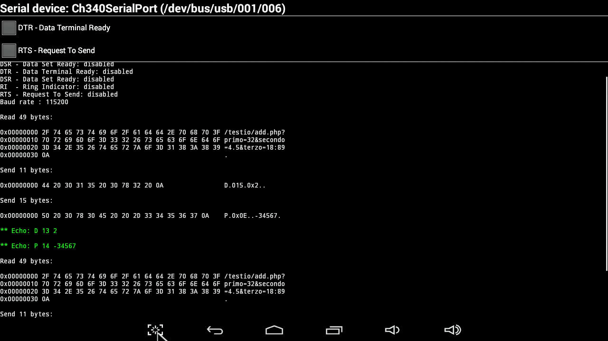
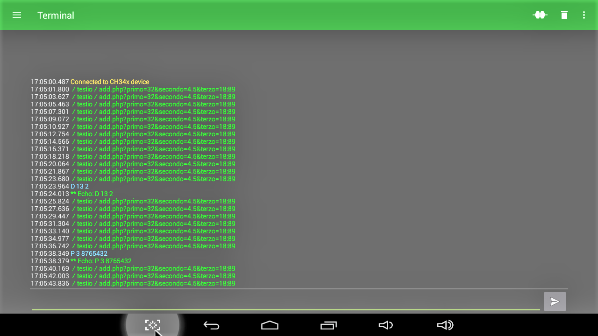

# USBphpTunnel
Android app for MXQ TV box to control an Arduino board via USB from PHP.

## How it works

 On USBphpTunnel terminal you can see:
 

 
         data received from Arduino ("Read 49 bytes"): **
               the data MUST be a relative URL, like: '"/testio/add.php?primo=32&secondo=4.5&terzo=18:09"' and MUST 
               start with "/". So [phpPath (in config) + data]  makes an absolute URL, called by USBphpTunnel.
               note: Your Arduino Sketch will build relative URLs using the requiered PHP pages and actual values.

               The PHP sample code in add.php (see /test_files/www/testio/add.php): 
                   a) adds a record to MySQL table datatest.esempio
                   b) buids the response: pure ASCII (not HTML)
               USBphpTunnel sends the response to Arduino:
         
          data sended to Arduino ("Send 11 bytes")
               the data are commands, as defined in testser02.ino ( see /test_files/arduino/testser02.ino ):
                  1) Analog write,  sended as "A port value": A [3..11] [0..255] [0xD|0x0A] 
                     (as decimal, 0-octal, 0x-esa)
                  2) Digital write, sended as "D pin  value": D [2..13] [0|1|2] [0xD|0x0A]
                     (as decimal, 0-octal, 0x-esa) value: 0 = LOW, 1 = HIGH, 2 = TOGGLE
                  3) Parameter set, sended as "P index long-value":
                      P [0..15] [[-]0..2'147'483'647] [0xD|0x0A] (as decimal, 0-octal, 0x-esa)
               note: USBphpTunnel accepts any line terminator (\n or \r or \r\n) and transforns it in single
                      "0x0A" (\n)
               note: In your Arduino Sketch you can eliminate unused commands or add your custom commands. 
                     Commands MUST NOT start with "*" char.

          debug messages from Arduino ("** Echo: D 13 2") 
               the message MUST start with "*". It is show on terminal (not sended to php)
               note: green, color set on config.ini

          debug messages from PHP
               the message MUST start with "*". It is show on terminal (not sended to Arduino)
               note: red, color set on config.ini
               
  
  
    Because this protocol is pure text, we can also do testing with a standard terminal application.
    Arduino console terminal: the only terminal app that worked for me is
    "Serial USB terminal" https://play.google.com/store/apps/details?id=de.kai_morich.serial_usb_terminal
    
 ###Developped an tested using:
       MXQ ("MXQ 4K*2K 1080P Smart TV BOX XBMC/Kodi H.265 Android Quad Core WiFi 8GB Mini PC") 
                            http://www.ebay.it/itm/141956901542 (29.78 €)
       ARDIINO UNO (UNO R3 Scheda Micro USB ATmega328P CH340G Board Modulo Controllore per Arduino) 
                            http://www.ebay.it/itm/152002551433 (5.79 €)
      
   ### CONCLUSIONS
    Now you can develop MySQL and web enabled Arduino applications only working on Arduino and PHP. 
    To keep ligth the Arduino Sketch, you can port all not realtime logic to PHP side.
    At the end your application will works on MXQ+Arduino also 24/7 with only 20 Watt AC power, and can also
    be controlled by smartphone via WiFi.
    What more?
    Enjoy.

  
